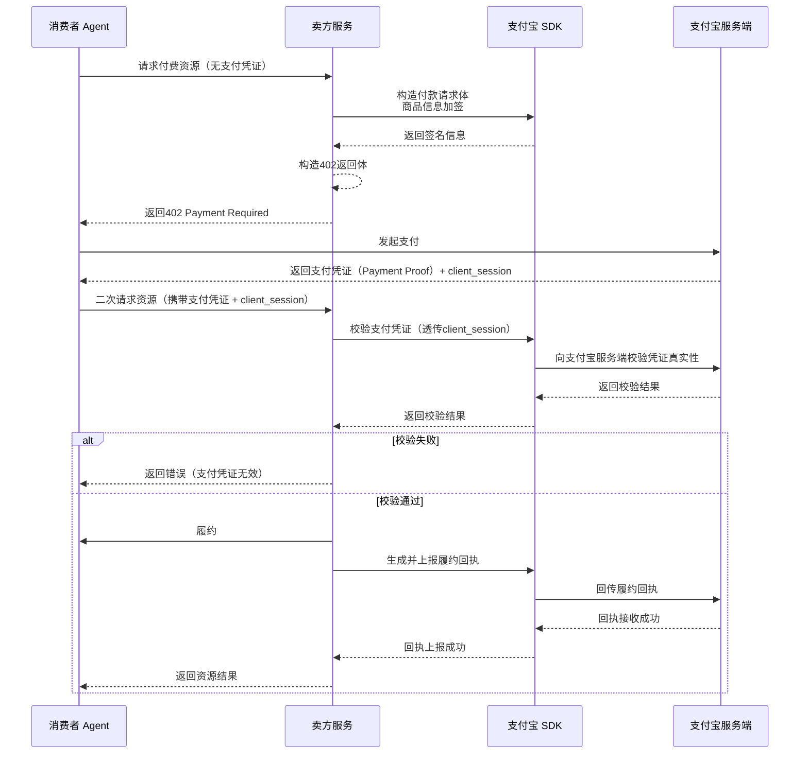
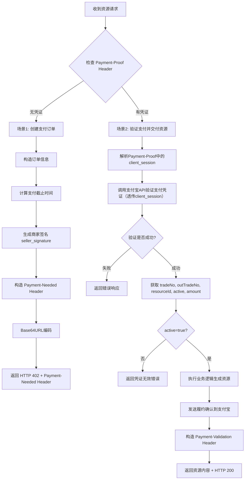

# A2M 智能收产品对接技术文档

## 一、产品概述

A2M智能收产品是一种基于 HTTP 402 状态码的支付协议实现，允许商户向消费者提供付费数字资源服务。

---

## 二、核心流程图

### 2.1 完整业务时序图



### 2.2 接口处理流程图



---

## 三、典型工作流程

根据代码实现，典型工作流程如下：

| 步骤 | 描述 | 操作说明 |
|------|------|----------|
| 1 | 收到消费者的付费资源请求（不带支付凭证） | 检测 `Payment-Proof` Header 是否存在 |
| 2 | 构造 402 付款请求体并对商品信息加签 | 使用支付宝 SDK 的签名方法（不调用 OpenAPI 接口） |
| 3 | 响应 402 请求体给消费者 | 返回 HTTP 402 + `Payment-Needed` Header |
| 4 | 收到带支付凭证的二次资源请求后验证支付凭证 | 使用支付宝 SDK 调用验证接口 |
| 5 | 验证通过则履约 | 执行业务逻辑，交付资源 |
| 6 | 将履约回执返回到支付宝 | 使用支付宝 SDK 上报履约确认 |

---

## 四、接口详细说明

### 4.1 统一资源接口

**接口路径：** `GET /demo/a2m/resource`

**请求头：**

| Header 名称 | 必填 | 说明 |
|-------------|------|------|
| Payment-Proof | 否 | 支付凭证，二次请求时携带。Base64URL 解码后为 JSON 对象，包含 `protocol`（支付凭证和交易号）和 `method`（含 `client_session` 买家客户端会话标识） |

---

### 4.2 场景一：首次请求（无支付凭证）

当消费者首次请求资源且不带 `Payment-Proof` Header 时，商户服务返回 HTTP 402 状态码。

#### 响应信息

**HTTP 状态码：** `402 Payment Required`

**响应头：**

| Header 名称 | 说明 |
|-------------|------|
| Payment-Needed | Base64URL 编码的 JSON 对象，包含支付所需信息 |

**Payment-Needed Header 解码后的 JSON 结构：**

| 字段名 | 类型 | 说明                     |
|--------|------|------------------------|
| out_trade_no | String | 商户订单号                  |
| amount | String | 金额（单位：元）               |
| currency | String | 币种（目前仅支持CNY）           |
| resource_id | String | 资源ID                   |
| pay_before | String | 支付截止时间（ISO 8601 格式）    |
| seller_signature | String | 商家签名（RSA2）             |
| seller_sign_type | String | 签名类型（固定值：RSA2）         |
| seller_unique_id | String | 商家唯一标识                 |
| seller_name | String | 商家名称                   |
| seller_id | String | 商家ID（2088格式）           |
| seller_app_id | String | 商家应用 AppId             |
| goods_name | String | 商品名称                   |
| seller_unique_id_key | String | 商家唯一标识键（固定值：seller_id） |
| service_id | String | 商家服务ID                 |

**响应体示例：**

```json
{
  "code": "Payment-Needed",
  "message": "需要支付",
  "out_trade_no": "ORDER_1744721077123",
  "amount": "1000",
  "currency": "CNY",
  "goods_name": "AI 生成内容服务"
}
```

---

### 4.3 场景二：二次请求（携带支付凭证）

当消费者携带 `Payment-Proof` Header 再次请求资源时，商户服务执行验证和履约流程。

#### Payment-Proof Header 结构

Payment-Proof Header 为 Base64URL 编码的 JSON 对象，解码后结构如下：

```json
{
  "protocol": {
    "payment_proof": "7cf8a6a93c924e13eaa4bf20c3a487f30d1fbdb759a1f229b4091b7d0158xxxx",
    "trade_no": "2026040900828111317760000001xxxx"
  },
  "method": {
    "client_session": "ImNsaWVudFNlc3Npb24iOiB7CiAgICAiYWdlbnRUb2tlbiI6ICJ4eCIsCiAgICAic2Vzc2lvbklkIjogInh4IiwKICAgICJzaWduYXR1cmUiOiAi5Yqg562+5ZCO57uT5p6c77yM6YCa6L+HY3JlZGVudGlhbElk5Yqg562+YWdlbnRUb2tlbiArIHNlc3Npb25JZCkiCn0="
  }
}
```

**Payment-Proof 解码后字段说明：**

| 字段路径 | 类型 | 说明 |
|----------|------|------|
| protocol.payment_proof | String | 支付凭证 |
| protocol.trade_no | String | 支付宝交易号 |
| method.client_session | String | 买家客户端会话标识（Base64编码字符串），由 C agent 通过支付宝 CLI 生成，用于支付宝服务端校验买家身份 |

#### 验证流程

1. **解析 Payment-Proof Header**
   - Base64URL 解码 Payment-Proof Header
   - 提取 `protocol.payment_proof`、`protocol.trade_no` 和 `method.client_session` 字段

2. **调用支付宝 API 验证凭证**
   - 使用 `AlipayAipayAgentPaymentVerifyRequest` 接口
   - 传入 `paymentProof`、`tradeNo` 和 `clientSession` 参数（其中 `clientSession` 为本次新增，需透传给支付宝服务端校验）

3. **获取验证结果字段**
   - `tradeNo`：支付宝订单号
   - `outTradeNo`：商户订单号
   - `resourceId`：资源ID
   - `active`：凭证有效标识（true 表示有效）
   - `amount`：订单金额

4. **校验凭证有效性**
   - 检查 `active` 是否为 `true`

#### 履约流程

1. 执行业务逻辑，生成资源内容
2. 发送履约确认到支付宝

#### 响应信息

**HTTP 状态码：** `200 OK`

**响应头：**

| Header 名称 | 说明 |
|-------------|------|
| Payment-Validation | Base64URL 编码的 JSON 对象，包含验证信息 |

**Payment-Validation Header 解码后的 JSON 结构：**

| 字段名 | 类型 | 说明 |
|--------|------|------|
| trade_no | String | 支付宝订单号 |
| out_trade_no | String | 商户订单号 |
| validated | Boolean | 验证通过标识 |
| resource_id | String | 资源ID |

**响应体示例：**

```json
{
  "resource_id": "/demo/a2m/resource",
  "content": "{\"status\":\"success\",\"service_type\":\"AI_CONTENT_GENERATION\",\"resource_id\":\"/demo/a2m/resource\",\"content\":\"这是AI生成的内容示例\",\"generated_at\":\"2026-04-15T20:30:00+08:00\"}",
  "trade_no": "2026041522001401234567890",
  "out_trade_no": "ORDER_1744721077123",
  "already_fulfilled": false
}
```

---

## 五、支付宝 SDK 使用说明

### 5.1 初始化 AlipayClient

```java
AlipayConfig alipayConfig = new AlipayConfig();
alipayConfig.setServerUrl("https://openapi.alipay.com/gateway.do");
alipayConfig.setAppId("您的AppId");
alipayConfig.setPrivateKey("您的应用私钥");
alipayConfig.setFormat("json");
alipayConfig.setAlipayPublicKey("支付宝公钥");
alipayConfig.setCharset("UTF-8");
alipayConfig.setSignType("RSA2");

AlipayClient alipayClient = new DefaultAlipayClient(alipayConfig);
```

### 5.2 验证支付凭证

```java
AlipayAipayAgentPaymentVerifyRequest verifyRequest = new AlipayAipayAgentPaymentVerifyRequest();
AlipayAipayAgentPaymentVerifyModel model = new AlipayAipayAgentPaymentVerifyModel();
model.setPaymentProof(paymentProof);
model.setTradeNo(tradeNo);
model.setClientSession(clientSession); // 买家客户端会话标识，从Payment-Proof中method.client_session提取，透传给支付宝校验
verifyRequest.setBizModel(model);

AlipayAipayAgentPaymentVerifyResponse verifyResponse = alipayClient.execute(verifyRequest);
```

### 5.3 发送履约确认

```java
AlipayAipayAgentFulfillmentConfirmRequest request = new AlipayAipayAgentFulfillmentConfirmRequest();
AlipayAipayAgentFulfillmentConfirmModel model = new AlipayAipayAgentFulfillmentConfirmModel();
model.setTradeNo(tradeNo);
request.setBizModel(model);

AlipayAipayAgentFulfillmentConfirmResponse response = alipayClient.execute(request);
```

### 5.4 生成商家签名

```java
// 1. 按key字典序排序
List<String> keys = new ArrayList<>(params.keySet());
Collections.sort(keys);

// 2. 拼接签名内容
StringBuilder signContent = new StringBuilder();
for (int i = 0; i < keys.size(); i++) {
    String key = keys.get(i);
    String value = params.get(key);
    if (value != null && !value.trim().isEmpty()) {
        signContent.append(key).append("=").append(value);
        if (i < keys.size() - 1) {
            signContent.append("&");
        }
    }
}

// 3. RSA2签名
String signature = AlipaySignature.rsaSign(signContent.toString(), privateKey, "UTF-8", "RSA2");
```

---

## 六、错误码说明

| 错误码 | HTTP 状态码 | 说明 |
|--------|-------------|------|
| Payment-Needed | 402 | 需要支付，首次请求时返回 |
| SIGN_ERROR | 500 | 签名失败 |
| CREATE_ORDER_ERROR | 500 | 创建订单失败 |
| INVALID_PAYMENT_PROOF | 400 | 支付凭证无效或已过期 |
| VERIFY_FAILED | 500 | 支付凭证验证失败 |
| FULFILLMENT_ERROR | 500 | 履约处理失败 |

---

## 七、注意事项

1. **配置安全**：示例代码中的私钥、公钥、AppId 等敏感信息需要从配置中心读取，切勿硬编码
2. **日志记录**：关键操作需要记录日志，便于排查问题
3. **异常处理**：需要妥善处理各种异常情况，返回友好的错误信息
4. **时间格式**：支付截止时间使用 ISO 8601 格式（如：`2026-04-15T12:54:37+08:00`）
5. **金额单位**：金额单位为元
6. **client_session 透传**：`client_session` 由 C agent 通过支付宝 CLI 生成并传递，商家 agent 必须将其从 Payment-Proof Header 中原样提取并透传给支付宝凭证校验接口，不得修改、缓存或自行构造该字段，否则会导致校验失败

---