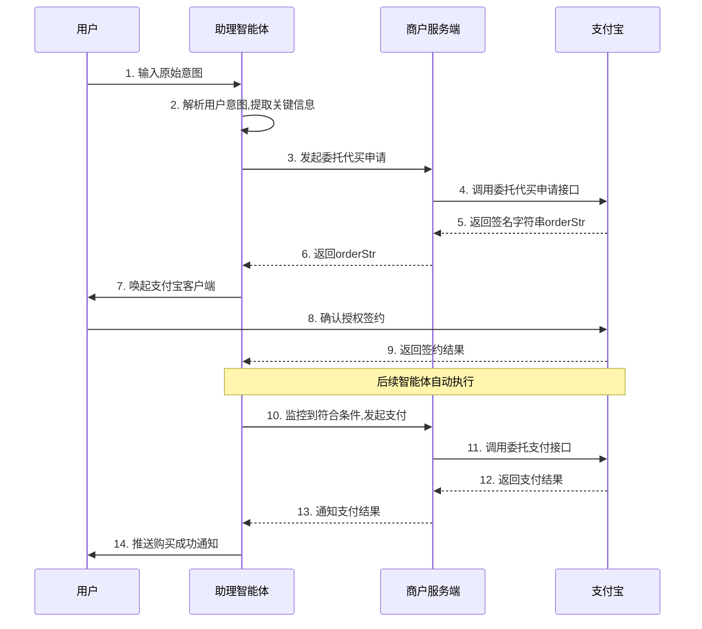
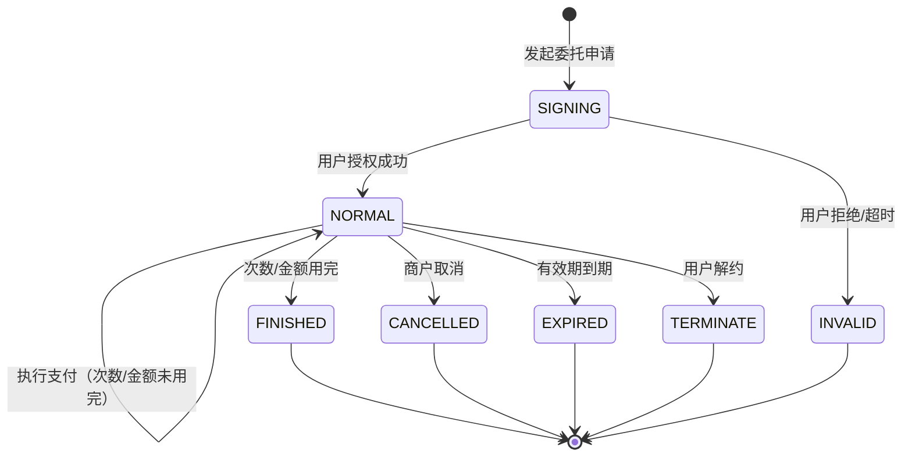
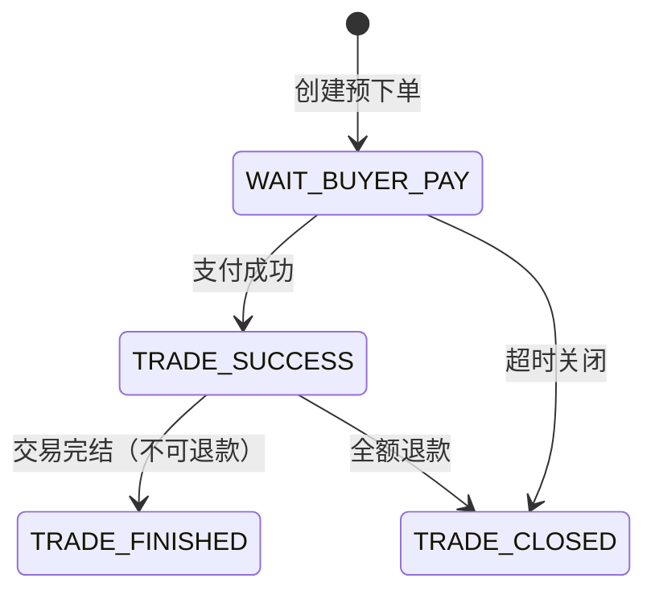
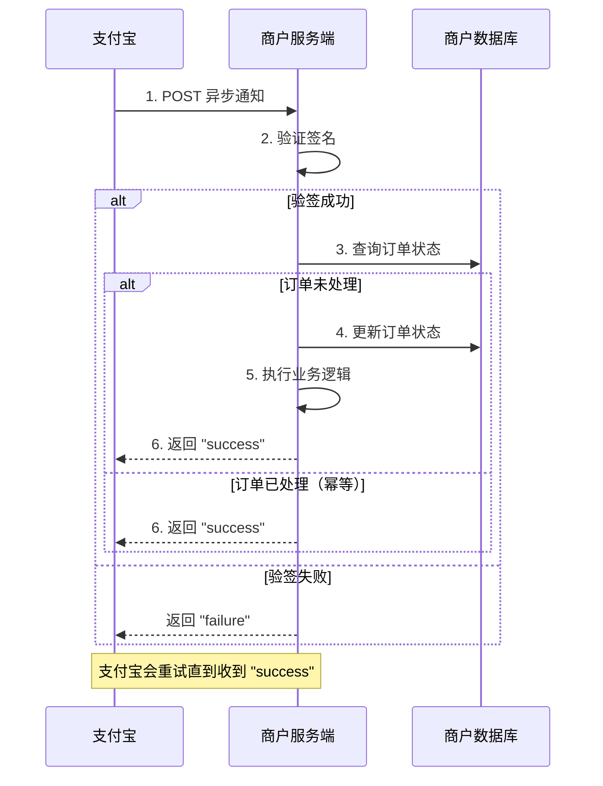

# 委托支付接入指南

## 产品介绍

委托支付是支付宝为商户提供的智能体（Agent）代理支付解决方案。用户预先授权（含金额、次数、有效期限制），后续由智能体在授权范围内自动执行支付，适用于代买、抢票、监控购买等自动化场景。

| 能力 | 说明 | 适用场景 | 接口文档 |
|------|------|---------|---------|
| 委托支付 | 用户预先授权，后续由智能体自动执行 | 代买、抢票、监控购买等自动化场景 | `references/delegation/` |

## ⚠️ 接入前必读：接入清单（陌生商户从零开始）

> 第一次接入的商户，务必先按此清单完成准备，否则会卡在"没有 appId/密钥/产品权限"无法调用任何接口。
> 详细步骤见 **[接入准备](references/00-接入准备.md)**。

| # | 准备项 | 关键点 |
|---|--------|--------|
| 1 | 创建应用拿 `APPID` | 登录 [开放平台](https://open.alipay.com) 建应用 |
| 2 | 生成 RSA2 密钥、配置加签 | 拿到 `应用私钥` + `支付宝公钥`（资金接口必做） |
| 3 | **开通「智能体代理支付」产品** | **邀测产品，必须联系 BD 开通**；委托场景另需开通 **App 支付**（供预下单用） |
| 4 | 应用上线 | 网页/移动应用需提交审核 |
| 5 | 集成服务端 SDK | Java/PHP/Node/Python/.NET；初始化 `AlipayClient` |
| 6 | 沙箱验证签名与连通 | 生产前先在沙箱跑通 |

> ✅ 可运行的完整端到端示例见 `examples/sandbox-demo/`（官方 SDK，照着改即可跑）。

## 快速导航

根据你的需求，选择对应的章节：

### 委托支付

| 需求 | 章节 |
|------|------|
| 了解整体流程 | [委托支付业务流程](#业务流程) |
| 发起委托签约 | [步骤2：发起委托代买申请](#步骤2发起委托代买申请) |
| 客户端唤起支付宝 | [步骤3：唤起支付宝客户端](#步骤3唤起支付宝客户端) |
| 查询委托状态 | [步骤4：查询委托任务状态](#步骤4查询委托任务状态) |
| 商户预下单（拿 prepay_id） | [步骤5：商户预下单](#步骤5商户预下单获取-prepay_id) |
| 执行扣款 | [步骤6：执行委托支付](#步骤6执行委托支付) |
| 取消委托 | [步骤7：取消委托任务](#步骤7取消委托任务可选) |

### 通用配置

| 需求 | 章节 |
|------|------|
| 接口调用方式 | [接口调用方式](#接口调用方式) |
| 接口串联关系 | [接口串联关系](#接口串联关系) |
| 状态流转 | [状态流转](#状态流转) |
| 异步消息 | [异步消息](#异步消息) |
| 幂等控制 | [幂等控制](#幂等控制) |
| SDK配置 | [SDK配置](#sdk配置) |
| 错误处理 | [常见错误码](#常见错误码) |
| 遇到"无效签名"/联调排错 | [故障排查](references/故障排查.md) |

如需查看详细的接口参数说明，请参考 `references/` 目录下的接口文档。

---

## 接入概述

### 接口调用方式

委托支付涉及三种接口调用方式，接入方需要根据场景选择正确的调用方式：

| 调用方式 | 说明 | 适用接口 | 调用方 |
|---------|------|---------|--------|
| **服务端接口** | 商户服务端直接调用支付宝网关 | 委托支付、协议查询、委托取消 | 商户服务端 |
| **SDK签名接口** | 服务端生成签名串，返回给客户端唤起支付宝 | 委托代买申请、发起委托支付 | 商户服务端生成 → 客户端使用 |
| **客户端SDK** | 客户端直接调用支付宝SDK | 唤起支付宝客户端 | Android/iOS 客户端 |

### 接口串联关系

#### 委托支付接口串联

```
┌─────────────────────────────────────────────────────────────────────────────┐
│                            委托支付接口调用链路                               │
├─────────────────────────────────────────────────────────────────────────────┤
│                                                                             │
│  ┌──────────────────┐    ┌──────────────────┐    ┌──────────────────┐      │
│  │ 1. 委托代买申请   │───?│ 2. 唤起支付宝    │───?│ 3. 用户授权签约   │      │
│  │ (服务端SDK签名)   │    │ (客户端SDK)      │    │ (支付宝客户端)    │      │
│  │                  │    │                  │    │                  │      │
│  │ 输出: orderStr   │    │ 输入: orderStr   │    │ 输出: agreement_no│      │
│  │                  │    │                  │    │       delegation_id│     │
│  └──────────────────┘    └──────────────────┘    └────────┬─────────┘      │
│                                                           │                 │
│         ┌─────────────────────────────────────────────────┘                 │
│         ▼                                                                   │
│  ┌──────────────────┐    ┌──────────────────┐    ┌──────────────────┐      │
│  │ 4. 查询委托状态   │?──?│ 5. 商户预下单     │───?│ 6. 执行委托支付   │      │
│  │ (服务端接口)      │    │ (商户·服务端接口) │    │ (服务端接口)      │      │
│  │                  │    │                  │    │                  │      │
│  │ 输入: agreement_no│   │ 输入: out_trade_no│   │ 输入: prepay_id  │      │
│  │       delegation_id│  │   payment_type   │    │       agreement_no│      │
│  │ 输出: status     │    │ =agent_pay       │    │       delegation_id│     │
│  │                  │    │ 输出: prepay_id  │    │ 输出: trade_no   │      │
│  └──────────────────┘    └──────────────────┘    └────────┬─────────┘      │
│                                                           │                 │
│         ┌─────────────────────────────────────────────────┘                 │
│         ▼                                                                   │
│  ┌──────────────────┐                                                       │
│  │ 7. 异步通知      │   可选: ┌──────────────────┐                          │
│  │ (支付宝推送)     │         │ 8. 取消委托任务   │                          │
│  │ 输出: trade_status│        │ (服务端接口)      │                          │
│  │       trade_no   │        └──────────────────┘                          │
│  └──────────────────┘                                                       │
└─────────────────────────────────────────────────────────────────────────────┘
```

### 关键标识说明

接入过程中会涉及多个关键标识，理解它们的关系非常重要：

| 标识 | 生成方 | 作用 | 生命周期 |
|------|-------|------|---------|
| `external_agreement_no` | 商户 | 商户侧签约唯一标识，用于幂等控制 | 商户自定义 |
| `agreement_no` | 支付宝 | 支付宝协议号，后续接口调用必传 | 签约成功后返回 |
| `external_delegation_id` | 商户 | 商户侧委托任务唯一标识（仅委托支付） | 商户自定义 |
| `delegation_id` | 支付宝 | 支付宝委托任务号（仅委托支付） | 签约成功后返回 |
| `prepay_id` | 支付宝 | 预下单ID，通过预下单接口获取 | 支付前获取 |
| `out_trade_no` | 商户 | 商户订单号，用于交易幂等控制 | 商户自定义 |
| `trade_no` | 支付宝 | 支付宝交易号 | 支付成功后返回 |

---

## 委托支付能力

### 业务流程



### 接入步骤

#### 步骤1：用户意图解析

当用户在助理智能体中输入原始意图时，智能体需要解析并提取以下关键信息：

| 提取字段 | 说明 | 示例 |
|---------|------|------|
| delegation_desc | 委托任务描述 | 监控1月20日北京去哈尔滨的高铁二等座 |
| delegation_tag | 委托标签/场景 | 购买火车票 |
| max_total_amount | 最大授权金额 | 500.00 |
| validity_start_time | 生效开始时间 | 2026-01-15 |
| validity_end_time | 生效结束时间 | 2026-01-20 |

#### 步骤2：发起委托代买申请

调用 `alipay.user.agreement.delegation.apply` 接口生成签名字符串，用于唤起支付宝客户端完成用户授权。

```java
// 初始化SDK
AlipayClient alipayClient = new DefaultAlipayClient(getAlipayConfig());

// 构造请求
AlipayUserAgreementDelegationApplyRequest request = new AlipayUserAgreementDelegationApplyRequest();
AlipayUserAgreementDelegationApplyModel model = new AlipayUserAgreementDelegationApplyModel();

// 设置智能体id
model.setAgentId("your_agent_id");

// 设置商户签约号（需在商户系统中唯一）
model.setExternalAgreementNo("agreement_" + System.currentTimeMillis());

// 设置个人签约产品码（固定值）
model.setPersonalProductCode("UAM_AGENT_AUTH_P");

// 设置对话历史（用于展示给用户确认）
List<Conversation> conversationHistory = new ArrayList<>();
Conversation userMsg = new Conversation();
userMsg.setRole("USER");
userMsg.setContent("帮我抢一张1月20号回哈尔滨的票，二等座。");
userMsg.setCreateTime("2025-12-23 10:28:00");
conversationHistory.add(userMsg);

Conversation assistantMsg = new Conversation();
assistantMsg.setRole("ASSISTANT");
assistantMsg.setContent("好的，我将为您监控1月20日北京到哈尔滨的高铁二等座车票。");
assistantMsg.setCreateTime("2025-12-23 10:28:05");
conversationHistory.add(assistantMsg);

model.setConversationHistory(conversationHistory);

// 设置委托参数
DelegationParams delegationParams = new DelegationParams();
delegationParams.setExternalDelegationId("delegation_" + System.currentTimeMillis());
delegationParams.setDelegationDesc("监控1月20日北京去哈尔滨的高铁二等座");
delegationParams.setDelegationTag("购买火车票");
delegationParams.setMaxTotalAmount("500.00");
delegationParams.setTimesLimit("3");
delegationParams.setValidityStartTime("2026-01-15");
delegationParams.setValidityEndTime("2026-01-20");
model.setDelegationParams(delegationParams);

// 设置接入渠道（固定值）
AccessParams accessParams = new AccessParams();
accessParams.setChannel("ALIPAYAPP");
model.setAccessParams(accessParams);

request.setBizModel(model);

// 执行请求，获取签名字符串
AlipayUserAgreementDelegationApplyResponse response = alipayClient.sdkExecute(request);
String orderStr = response.getBody();

// 将orderStr返回给客户端，用于唤起支付宝
return orderStr;
```

#### 步骤3：唤起支付宝客户端

客户端收到 `orderStr` 后，调用支付宝SDK唤起支付宝客户端：

**Android端：**
```java
// 调用支付宝SDK
PayTask payTask = new PayTask(activity);
Map<String, String> result = payTask.payV2(orderStr, true);

// 解析结果
String resultStatus = result.get("resultStatus");
if ("9000".equals(resultStatus)) {
    // 签约成功，获取agreement_no和delegation_id
    String resultContent = result.get("result");
    // 解析resultContent获取签约信息
}
```

**iOS端：**
```objc
[[AlipaySDK defaultService] payOrder:orderStr fromScheme:@"yourAppScheme" callback:^(NSDictionary *resultDic) {
    NSString *resultStatus = resultDic[@"resultStatus"];
    if ([resultStatus isEqualToString:@"9000"]) {
        // 签约成功
        NSString *result = resultDic[@"result"];
        // 解析result获取签约信息
    }
}];
```

#### 步骤4：查询委托任务状态

用户签约成功后，可以通过 `alipay.user.agreement.delegation.query` 接口查询委托任务详情：

```java
// 初始化SDK
AlipayClient alipayClient = new DefaultAlipayClient(getAlipayConfig());

// 构造请求
AlipayUserAgreementDelegationQueryRequest request = new AlipayUserAgreementDelegationQueryRequest();
AlipayUserAgreementDelegationQueryModel model = new AlipayUserAgreementDelegationQueryModel();

// 设置协议标识（二选一）
model.setAgreementNo("20265005004910872660");
// 或使用外部签约号
// model.setExternalAgreementNo("agreement_xxx");

// 设置委托标识（二选一）
model.setDelegationId("2026001");
// 或使用外部委托号
// model.setExternalDelegationId("delegation_xxx");

request.setBizModel(model);

// 执行请求
AlipayUserAgreementDelegationQueryResponse response = alipayClient.execute(request);

if (response.isSuccess()) {
    String status = response.getStatus();           // 委托状态：NORMAL-正常
    String remainingAmount = response.getRemainingAmount();  // 剩余可用金额
    String remainingTimes = response.getRemainingTimes();    // 剩余次数
    String validityEndTime = response.getValidityEndTime();  // 有效期结束时间
    
    System.out.println("委托状态: " + status);
    System.out.println("剩余金额: " + remainingAmount + "元");
    System.out.println("剩余次数: " + remainingTimes);
}
```

#### 步骤5：商户预下单（获取 prepay_id）

执行委托扣款**之前**，必须先由**商户服务端**调用 `alipay.trade.order.prepay`（统一收单交易订单预支付接口）拿到 `prepay_id`。委托支付接口本身不创建订单，它只对已预下单的订单扣款。

> **前置权限**：商户需先开通 **App 支付** 产品（否则返回 `ACCESS_FORBIDDEN` 40006）。
> **关键配置**：智能体场景必须 `payment_type=agent_pay`、`product_code=QUICK_MSECURITY_PAY`，否则不返回 `prepay_id`。

```java
// 初始化SDK（商户服务端）
AlipayClient alipayClient = new DefaultAlipayClient(getAlipayConfig());

AlipayTradeOrderPrepayRequest request = new AlipayTradeOrderPrepayRequest();
AlipayTradeOrderPrepayModel model = new AlipayTradeOrderPrepayModel();

// 必填：订单信息
model.setOutTradeNo("20150320010101001");
model.setTotalAmount("88.88");
model.setSubject("早餐盲盒");

// 智能体代理支付场景的关键配置
model.setProductCode("QUICK_MSECURITY_PAY");
model.setPaymentType("agent_pay");

request.setBizModel(model);
AlipayTradeOrderPrepayResponse response = alipayClient.execute(request);

String prepayId = response.getPrepayId();   // 有效期 2 小时，交给智能体发起委托支付
```

> 详细字段见 [预下单接口.md](references/delegation/预下单接口.md)。

#### 步骤6：执行委托支付

商户预下单拿到 `prepay_id` 后，智能体监控到符合条件的商品时，调用 `alipay.trade.agent.delegation.pay` 接口完成扣款：

> **前置条件**：已通过[步骤5：商户预下单](#步骤5商户预下单获取-prepay_id)获取 `prepay_id`（默认有效期 2 小时）。

```java
// 初始化SDK
AlipayClient alipayClient = new DefaultAlipayClient(getAlipayConfig());

// 构造请求
AlipayTradeAgentDelegationPayRequest request = new AlipayTradeAgentDelegationPayRequest();
AlipayTradeAgentDelegationPayModel model = new AlipayTradeAgentDelegationPayModel();

// 设置预下单ID（通过 alipay.trade.order.prepay 接口获取）
model.setPrepayId("your_prepay_id");

// 设置Agent签约协议号（用户签约成功后获得）
model.setAgreementNo("20170322450983769228");

// 设置代买委托id（用户签约成功后获得）
model.setDelegationId("2026001123456789");

request.setBizModel(model);

// 执行请求
AlipayTradeAgentDelegationPayResponse response = alipayClient.execute(request);

if (response.isSuccess()) {
    String tradeNo = response.getTradeNo();
    System.out.println("支付成功，支付宝交易号: " + tradeNo);
    // TODO: 通知用户购买成功
} else {
    String errorCode = response.getSubCode();
    String errorMsg = response.getSubMsg();
    System.out.println("支付失败: " + errorCode + " - " + errorMsg);
    // TODO: 根据错误码处理异常情况
}
```

#### 步骤7：取消委托任务（可选）

如需取消进行中的委托任务，调用 `alipay.user.agreement.delegation.cancel` 接口：

```java
// 初始化SDK
AlipayClient alipayClient = new DefaultAlipayClient(getAlipayConfig());

// 构造请求
AlipayUserAgreementDelegationCancelRequest request = new AlipayUserAgreementDelegationCancelRequest();
AlipayUserAgreementDelegationCancelModel model = new AlipayUserAgreementDelegationCancelModel();

// 设置协议号
model.setAgreementNo("20265002005167619007");

// 设置代买委托号
model.setDelegationId("20260202002630110000070000000001");

request.setBizModel(model);

// 执行请求
AlipayUserAgreementDelegationCancelResponse response = alipayClient.execute(request);

if (response.isSuccess()) {
    System.out.println("委托任务取消成功");
} else {
    System.out.println("取消失败: " + response.getSubCode() + " - " + response.getSubMsg());
}
```

---

## SDK配置

### AlipayClient初始化

```java
private AlipayConfig getAlipayConfig() {
    AlipayConfig alipayConfig = new AlipayConfig();
    
    // 支付宝网关地址
    alipayConfig.setServerUrl("https://openapi.alipay.com/gateway.do");
    
    // 应用ID
    alipayConfig.setAppId("your_app_id");
    
    // 应用私钥
    alipayConfig.setPrivateKey("your_private_key");
    
    // 支付宝公钥
    alipayConfig.setAlipayPublicKey("alipay_public_key");
    
    // 字符集
    alipayConfig.setCharset("UTF-8");
    
    // 签名类型
    alipayConfig.setSignType("RSA2");
    
    return alipayConfig;
}
```

### Maven依赖

```xml
<dependency>
    <groupId>com.alipay.sdk</groupId>
    <artifactId>alipay-sdk-java</artifactId>
    <version>4.40.852.ALL</version>
</dependency>
```

---

## 常见错误码

### 委托代买申请接口

| 错误码 | 说明 | 处理建议 |
|--------|------|---------|
| SYSTEM_ERROR | 系统繁忙 | 重试请求 |
| INVALID_PARAMETER | 参数有误 | 检查请求参数 |

### 委托支付接口

| 错误码 | 说明 | 处理建议 |
|--------|------|---------|
| ACQ.AGREEMENT_NOT_EXIST | 协议不存在或已解约 | 引导用户重新签约 |
| ACQ.AGREEMENT_INVALID | 用户协议失效 | 引导用户重新签约 |
| ACQ.BUYER_BALANCE_NOT_ENOUGH | 买家余额不足 | 提示用户充值 |
| ACQ.ORDER_NOT_EXIST | 订单不存在 | 检查prepay_id是否正确 |
| ACQ.TRADE_HAS_SUCCESS | 交易已支付成功 | 避免重复支付 |
| ACQ.TRADE_HAS_CLOSE | 交易已关闭 | 重新创建预下单 |

### 委托任务查询接口

| 错误码 | 说明 | 处理建议 |
|--------|------|---------|
| DELEGATION_NOT_EXIST | 委托任务不存在 | 检查委托号是否正确 |
| USER_AGREEMENT_NOT_EXIST | 用户协议不存在 | 检查协议号或引导重新签约 |

### 签名类错误

| 错误码 | 说明 | 处理建议 |
|--------|------|---------|
| 无效签名 / INVALID_SIGNATURE | 签名校验不通过 | 使用官方 SDK 一般不会出现；如手工拼签名串，检查签名内容和实际发送的请求参数是否完全一致（发什么签什么），详见 [故障排查 §1](references/故障排查.md#1-签名相关) |

## 状态流转

### 委托任务状态流转



| 状态 | 说明 | 可执行操作 |
|------|------|-----------|
| SIGNING | 签约中，等待用户授权 | 等待用户操作 |
| NORMAL | 正常，可执行支付 | 执行支付、查询、取消 |
| FINISHED | 已完成，次数或金额已用完 | 仅查询 |
| CANCELLED | 已取消，商户主动取消 | 仅查询 |
| EXPIRED | 已过期，超过有效期 | 仅查询 |
| TERMINATE | 已终止，用户解约 | 仅查询 |
| INVALID | 无效，用户拒绝或超时 | 无 |

### 交易状态流转



| 状态 | 说明 | 商户处理 |
|------|------|---------|
| WAIT_BUYER_PAY | 等待付款 | 等待支付结果 |
| TRADE_SUCCESS | 支付成功 | 发货/提供服务 |
| TRADE_FINISHED | 交易完结 | 交易结束，不可退款 |
| TRADE_CLOSED | 交易关闭 | 超时或退款导致关闭 |

---

## 异步消息

### 消息类型

| 消息类型 | 触发时机 | 通知地址配置 |
|---------|---------|-------------|
| 签约成功通知 | 用户完成签约授权 | 应用网关 |
| 签约解约通知 | 用户或商户解约 | 应用网关 |
| 支付结果通知 | 支付完成（成功/失败） | 接口中指定 notify_url |
| 委托任务状态变更 | 委托任务状态变化 | 应用网关 |

### 异步通知接入流程



### 通知处理要点

1. **验签必做**：所有异步通知必须验证签名，防止伪造请求
2. **幂等处理**：同一通知可能重复发送，需根据订单号做幂等判断
3. **快速响应**：处理完成后立即返回 `success`，业务逻辑异步处理
4. **重试机制**：支付宝会按照一定间隔重试，直到收到 `success` 或超过重试次数

### 委托支付异步通知处理

```java
@RequestMapping("/delegation/notify")
public String handleDelegationNotify(HttpServletRequest request) {
    Map<String, String> params = getAllRequestParams(request);
    
    // 1. 验签
    boolean signVerified = AlipaySignature.rsaCheckV1(
        params, alipayPublicKey, "UTF-8", "RSA2"
    );
    
    if (!signVerified) {
        return "failure";
    }
    
    // 2. 获取通知类型
    String notifyType = params.get("notify_type");
    
    // 3. 根据通知类型处理
    switch (notifyType) {
        case "dut_user_sign":  // 签约成功
            handleSignSuccess(params);
            break;
        case "dut_user_unsign":  // 解约通知
            handleUnsign(params);
            break;
        case "dut_delegation_status_change":  // 委托状态变更
            handleDelegationStatusChange(params);
            break;
        default:
            log.warn("未知通知类型: " + notifyType);
    }
    
    return "success";
}

private void handleSignSuccess(Map<String, String> params) {
    String agreementNo = params.get("agreement_no");
    String externalAgreementNo = params.get("external_agreement_no");
    String delegationId = params.get("delegation_id");
    
    // 更新签约状态
    delegationService.updateSignStatus(externalAgreementNo, agreementNo, delegationId, "SIGNED");
}

private void handleDelegationStatusChange(Map<String, String> params) {
    String delegationId = params.get("delegation_id");
    String status = params.get("status");
    
    // 更新委托任务状态
    delegationService.updateDelegationStatus(delegationId, status);
}
```

---

## 幂等控制

### 幂等设计原则

| 场景 | 幂等键 | 处理策略 |
|------|-------|---------|
| 签约申请 | `external_agreement_no` | 相同签约号返回已有协议 |
| 委托创建 | `external_delegation_id` | 相同委托号返回已有委托 |
| 支付请求 | `out_trade_no` | 相同订单号返回已有交易 |
| 异步通知 | `trade_no` + `trade_status` | 已处理的通知直接返回成功 |

### 商户侧幂等实现

```java
/**
 * 委托支付幂等处理示例
 */
public PayResult executePayWithIdempotent(String outTradeNo, String agreementNo, 
                                           String delegationId, String amount) {
    // 1. 先查询本地订单状态
    Order order = orderRepository.findByOutTradeNo(outTradeNo);
    
    if (order != null) {
        // 订单已存在，检查状态
        if ("PAID".equals(order.getStatus())) {
            // 已支付成功，直接返回
            return PayResult.success(order.getTradeNo());
        } else if ("PAYING".equals(order.getStatus())) {
            // 支付中，查询支付宝交易状态
            return queryAndSyncTradeStatus(outTradeNo);
        }
    }
    
    // 2. 创建本地订单（状态：PAYING）
    order = createOrder(outTradeNo, amount, "PAYING");
    
    try {
        // 3. 调用支付宝支付接口
        AlipayTradeAgentDelegationPayResponse response = executePayment(
            outTradeNo, agreementNo, delegationId, amount
        );
        
        if (response.isSuccess()) {
            // 4. 更新订单状态
            order.setTradeNo(response.getTradeNo());
            order.setStatus("PAID");
            orderRepository.save(order);
            return PayResult.success(response.getTradeNo());
        } else {
            // 处理失败情况
            order.setStatus("FAILED");
            order.setErrorCode(response.getSubCode());
            orderRepository.save(order);
            return PayResult.fail(response.getSubCode(), response.getSubMsg());
        }
    } catch (Exception e) {
        // 异常情况，需要查询确认
        return queryAndSyncTradeStatus(outTradeNo);
    }
}
```

---

## 委托支付最佳实践

1. **幂等性处理**：使用唯一的 `external_agreement_no` 和 `external_delegation_id`，避免重复创建
2. **状态校验**：支付前先查询委托任务状态，确保状态为 `NORMAL`
3. **金额校验**：支付前检查 `remaining_amount` 是否足够
4. **次数校验**：支付前检查 `remaining_times` 是否大于0
5. **有效期校验**：支付前检查当前时间是否在有效期内
6. **异常处理**：妥善处理各类错误码，给用户友好的提示
7. **日志记录**：记录完整的请求响应日志，便于问题排查

---

## 接口文档参考

当需要查看详细的接口参数、请求/响应字段说明时，请读取以下参考文档：

### 接入准备（第一次接入必读）

| 文档 | 参考文档路径 |
|------|-------------|
| 接入准备（注册/密钥/开通产品/沙箱） | `references/00-接入准备.md` |

### 委托支付（Delegation）

| 接口 | 参考文档路径 |
|------|-------------|
| 委托代买申请 | `references/delegation/委托代买申请接口.md` |
| 商户预下单 | `references/delegation/预下单接口.md` |
| 委托支付 | `references/delegation/委托支付接口.md` |
| 委托任务查询 | `references/delegation/委托任务查询接口.md` |
| 委托任务取消 | `references/delegation/委托任务取消接口.md` |
| 故障排查（无效签名、联调排错） | `references/故障排查.md` |
